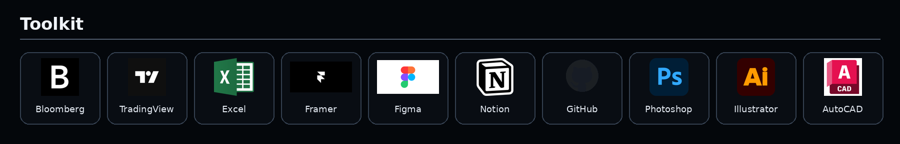
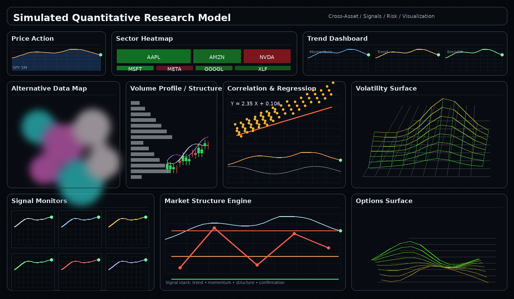

  

# William Yi

Focused on finance, markets, product strategy, and design.

I like turning complex information into clear, useful systems.

  

## Toolkit

  

## Simulated Quantitative Model

  

